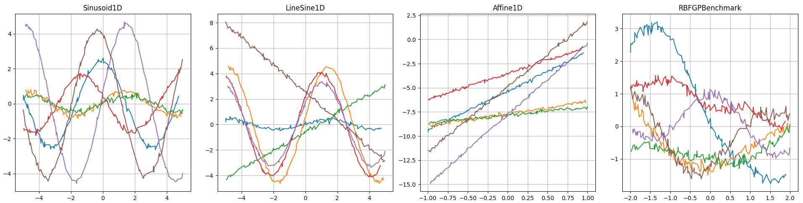

# Regression Tasks for Meta Learning

## What is this?
This is a NumPy implementation of several simple collections of benchmark tasks to test meta learning algorithms.



## Getting Started
Clone this repository and run
```
pip install . 
```
from the source directory.

To test that everything works fine, run the tests in ```./tests```.

## Usage
### Loading Benchmarks
```Python
from metalearning_benchmarks.quadratic1d_benchmark import Quadratic1D
benchmark = Quadratic1D(
    n_task=128,  # number of tasks
    n_datapoints_per_task=128, # number of evaluations per task
    output_noise=0.01, # Gaussian noise with std-dev 0.01
    seed_task=1235, 
    seed_x=123, 
    seed_noise=1237
)

# select a task from the benchmark collection of tasks
task = benchmark.get_task_by_index(126)

# plot a task 
import matplotlib.pyplot as plt
plt.scatter(task.x, task.y)
plt.show()
```

### Visualizing Benchmarks
Use the script ```./scripts/plot_1d_benchmark.py``` to visualize 1D benchmarks.

### Creating Your Own Benchmark
A benchmark that integrates well with the rest of the package can easily be implemented by inheriting from a base class. For parametric benchmarks, i.e. functions that can be constructed like y=f(x;p), with p being a vector of parameters, refer to ```base_parametric_benchmark.py``` and the annotations there. 
For a non-parametric benchmark, e.g., consisting of samples of a Gaussian process, inherit from ```base_benchmark.py```. 

## Notes
This code is still in development and thus not thoroughly tested. Features may change in the future. It was tested with the packages listed in ```./setup.cfg```.

## License
This code is licensed under the MIT license and is free to use by anyone without any restrictions.

